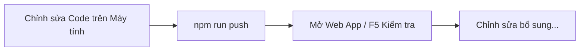

# 🏆 Hệ Thống Quản Lý Giải Đấu Thể Thao (Sport Tournament Management System)

Ứng dụng Web App quản lý giải đấu thể thao chuyên nghiệp (tạo giải đấu, đăng ký đội, tự động sinh lịch thi đấu vòng tròn / loại trực tiếp, cập nhật tỉ số, tính bảng xếp hạng và cây nhánh đấu) được phát triển trên nền tảng **Google Apps Script** và cơ sở dữ liệu **Google Sheets**.

---

## 📑 Mục Lục
1. [Yêu Cầu Tiền Đề (Prerequisites)](#1-yêu-cầu-tiền-đề-prerequisites)
2. [Cài Đặt & Cấu Hình Ban Đầu](#2-cài-đặt--cấu-hình-ban-đầu)
3. [Đăng Nhập & Ủy Quyền Google Account Cho Clasp](#3-đăng-nhập--ủy-quyền-google-account-cho-clasp)
4. [Các Lệnh Thao Tác Tự Động Với Apps Script](#4-các-lệnh-thao-tác-tự-động-với-apps-script)
5. [Hướng Dẫn Triển Khai Web App (Production Deployment)](#5-hướng-dẫn-triển-khai-web-app-production-deployment)
6. [Cấu Trúc Mã Nguồn (Project Structure)](#6-cấu-trúc-mã-nguồn-project-structure)
7. [Lưu Ý Kỹ Thuật Quan Trọng](#7-lưu-ý-kỹ-thuật-quan-trọng)

---

## 1. Yêu Cầu Tiền Đề (Prerequisites)

Trước khi bắt đầu, hãy đảm bảo máy tính của bạn đã cài đặt các công cụ sau:

- **Node.js** (Phiên bản v16.0.0 trở lên): Download tại [nodejs.org](https://nodejs.org/).
- **npm** (Đi kèm với Node.js).
- **Tài khoản Google**: Nơi lưu trữ Google Sheet và Google Apps Script project.
- **Bật Google Apps Script API** *(Bắt buộc)*:
  1. Truy cập vào trang Cài đặt Apps Script: [script.google.com/home/usersettings](https://script.google.com/home/usersettings).
  2. Bật tùy chọn **Google Apps Script API** sang trạng thái **ON** (Bật).

---

## 2. Cài Đặt & Cấu Hình Ban Đầu

1. **Mở terminal** (PowerShell / Command Prompt / Git Bash) tại thư mục dự án:
   ```bash
   cd "ten du an"
   ```

2. **Cài đặt các gói phụ thuộc (Dependencies):**
   ```bash
   npm install
   ```

3. **Cài đặt Clasp toàn cục (Hoặc dùng `npx` trực tiếp):**
   ```bash
   npm install -g @google/clasp
   ```

---

## 3. Đăng Nhập & Ủy Quyền Google Account Cho Clasp

Lệnh `clasp` (Command Line Apps Script Projects) giúp bạn đồng bộ mã nguồn giữa máy tính cá nhân và Google Apps Script Cloud.

### 3.1. Đăng nhập Clasp
Chạy lệnh đăng nhập:
```bash
npm run login
# Hoặc: npx clasp login
```
- Trình duyệt sẽ tự động mở trang đăng nhập Google.
- Chọn tài khoản Google sở hữu project Apps Script và cấp quyền cho **Google Apps Script CLI**.
- Sau khi thành công, màn hình sẽ báo `Logged in! Cached credentials to ~/.clasprc.json`.
Lưu ý: Chỉ nên cấp quyền tối thiểu các quyền liên quan đến Appscript để đảm bảo chạy ổn định và quyền xem ở Drive để đảm bảo mật và an toàn dữ liệu.

### 3.2. Kiểm tra liên kết Project (`.clasp.json`)
File `.clasp.json` nằm ở thư mục gốc của dự án dùng để liên kết mã nguồn local với Cloud Project:
```json
{
  "scriptId": "1B8Dq_Pfh8AAvT14ptcKc2TTruvW5ZnmRIC_DA8NM_TMtHITbILpnCP7h",
  "rootDir": "",
  "scriptExtensions": [".js", ".gs"],
  "htmlExtensions": [".html"],
  "jsonExtensions": [".json"]
}
```
*Lưu ý: Nếu muốn liên kết với một Script Project khác, bạn chỉ cần thay thế giá trị `scriptId` trong file `.clasp.json`.*

---

## 4. Các Lệnh Thao Tác Tự Động Với Apps Script

Dự án đã được cấu hình sẵn các câu lệnh npm rút gọn trong `package.json`:

| Câu lệnh npm | Câu lệnh clasp tương đương | Công dụng |
|--------------|---------------------------|-----------|
| `npm run push` | `npx clasp push` | **Đẩy toàn bộ mã nguồn** từ máy tính lên Google Apps Script Editor |
| `npm run pull` | `npx clasp pull` | **Kéo mã nguồn mới nhất** từ Google Apps Script về máy tính |
| `npm run open` | `npx clasp open` | **Mở trình duyệt** trực tiếp vào trang chỉnh sửa Google Apps Script Editor |
| `npm run deploy` | `npx clasp deploy` | Tạo một phiên bản triển khai (Deployment) mới |
| `npm run login` | `npx clasp login` | Đăng nhập tài khoản Google |

### Quy trình phát triển chuẩn (Recommended Workflow):


---

## 5. Hướng Dẫn Triển Khai Web App (Production Deployment)

Ứng dụng được thiết kế tối ưu nhất cho chế độ triển khai **Native Auth (Execute as user accessing the web app)**.

### Bước 1: Chia Sẻ Quyền Cho File Google Sheet Cơ Sở Dữ Liệu
1. Mở file Google Sheet chứa cơ sở dữ liệu dự án trên Google Drive.
2. Nhấp vào nút **Chia sẻ (Share)** ở góc trên bên phải.
3. Ở mục **Quyền truy cập chung (General access)**, đổi thành: **"Bất kỳ ai có liên kết" (Anyone with the link)**.
4. Chọn vai trò: **"Người chỉnh sửa" (Editor)**.
5. Bấm **Xong (Done)**.

### Bước 2: Triển Khai Web App Trên Google Apps Script
1. Chạy lệnh mở giao diện Apps Script:
   ```bash
   npm run open
   ```
2. Ở góc trên bên phải màn hình Apps Script Editor, nhấp **Triển khai (Deploy)** ➔ **Triển khai mới (New deployment)**.
3. Chọn loại triển khai: **Ứng dụng web (Web app)**.
4. Điền các thông số bắt buộc:
   - **Mô tả (Description):** Phiên bản chính thức (Production).
   - **Thực thi dưới dạng (Execute as):** `User accessing the web app` *(Người dùng truy cập ứng dụng web)*.
   - **Ai có quyền truy cập (Who has access):** `Anyone with Google account` *(Bất kỳ ai có tài khoản Google)*.
5. Bấm **Triển khai (Deploy)**.
6. Sao chép **URL Ứng dụng web (Web App URL)** để chia sẻ cho người dùng.

---

## 6. Cấu Trúc Mã Nguồn (Project Structure)

```text
d:\appscript\
├── appsscript.json        # File cấu hình Manifest của Google Apps Script
├── .clasp.json            # File kết nối Clasp với Google Script ID
├── package.json           # File cấu hình npm scripts & devDependencies
│
├── Server-side JavaScript (.js)
│   ├── Code.js            # Entry point render Web App (doGet) & include template helper
│   ├── Utils.js           # Schema cơ sở dữ liệu, BaseRepository ORM, UUID generator
│   ├── Auth.js            # Phân quyền Hệ thống & Giải đấu (System-level & Tournament RBAC)
│   ├── TournamentService.js # CRUD Giải đấu, Môn thi đấu & Bundle APIs cho Client
│   ├── TeamService.js     # Đăng ký đội, danh sách VĐV, duyệt/từ chối đơn
│   ├── MatchService.js    # Tự động sinh lịch thi đấu (Vòng tròn / Loại trực tiếp), nhập tỉ số
│   ├── RankingService.js  # Tính toán bảng xếp hạng, điểm số & tiêu chí phụ (Tiebreaker)
│   └── EmailService.js # Tự động gửi Email xác nhận đăng ký & lịch thi đấu (GmailApp)
│
└── Client-side Views & UI (.html)
    ├── Index.html         # Khung HTML chính của SPA (Layout, Navbar, Container)
    ├── Styles.html        # System CSS Token, Dark Theme, Card UI, Glassmorphism, Animations
    ├── Scripts.html       # Client Router SPA, State Store, App.server wrapper, Role Map
    ├── Dashboard.html     # View Trang chủ: Danh sách giải đấu, bộ lọc tìm kiếm
    ├── TournamentCreate.html # View Tạo giải đấu & cấu hình môn thi đấu
    ├── TournamentManage.html # View Quản lý giải đấu (Duyệt đội, Gán trọng tài, Sinh lịch)
    ├── TeamRegister.html   # View Đăng ký đội & nhập danh sách thành viên
    ├── Schedule.html       # View Xem lịch thi đấu & nhập tỉ số (Cho Referee / Organizer)
    ├── MatchResult.html   # View Nhập kết quả trận đấu chi tiết
    ├── RankingView.html   # View Bảng xếp hạng & hiệu số điểm
    ├── BracketView.html   # View Cây nhánh đấu loại trực tiếp (Knockout Tree)
    └── Profile.html       # View Trang cá nhân & lịch sử tham gia
```

---

## 7. Lưu Ý Kỹ Thuật Quan Trọng

1. **Định dạng file Server:** 
   - Trên thư mục local, các file server-side được lưu dưới dạng đuôi `.js` (ví dụ `Auth.js`, `Utils.js`). 
   - Khi chạy `npm run push`, `clasp` sẽ **tự động biến đổi** các file `.js` này thành các file `.gs` tương thích trên môi trường Google Apps Script. 
   - *Không nên tự tạo file đuôi `.gs` ở local để tránh bị lệch cấu trúc file.*

2. **Cơ chế Singleton & Biến Toàn Cục:**
   - Các class Service (`AuthService`, `TournamentService`,...) được khởi tạo dạng **Global Singleton Helper** (`let _instance = null`) đảm bảo tương thích tuyệt đối với V8 Engine của Apps Script.

3. **Tối Ưu Hiệu Năng Vượt Trội (Single Round-Trip Bundle APIs):**
   - Tránh gọi nhiều hàm `google.script.run` liên tiếp trên giao diện Client.
   - Luôn sử dụng các hàm gộp dữ liệu như `apiGetSchedulePageBundle` hay `apiGetRankingPageBundle` để chỉ tốn **1 lần gọi duy nhất** giữa Client và Server.
